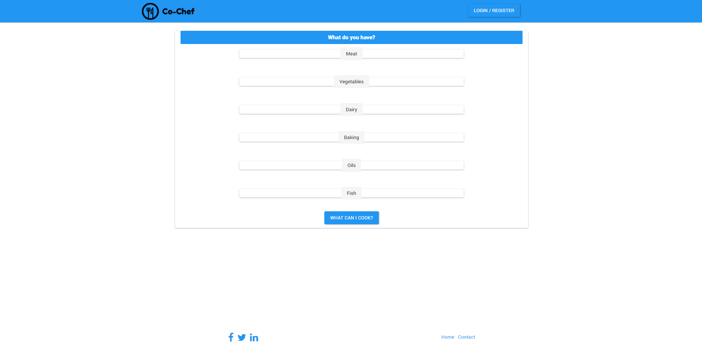
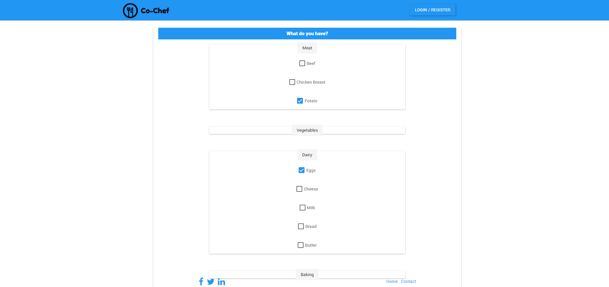
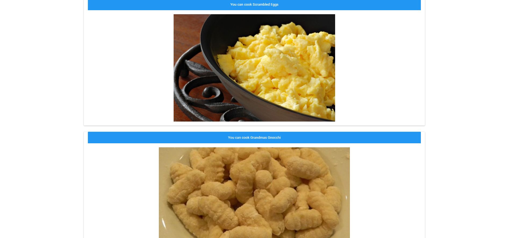
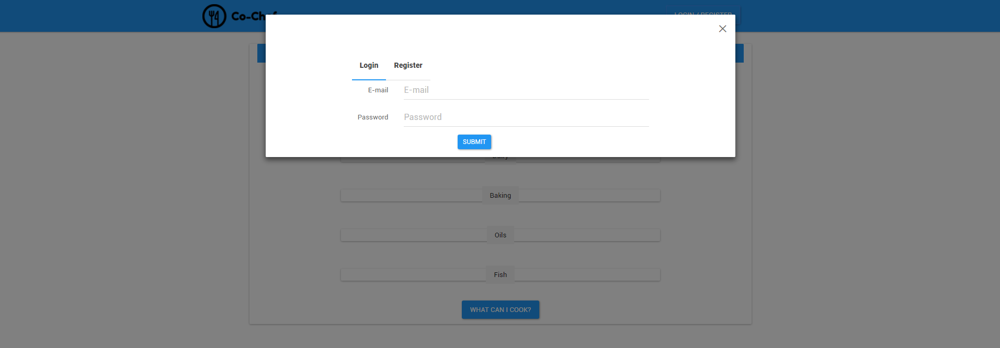
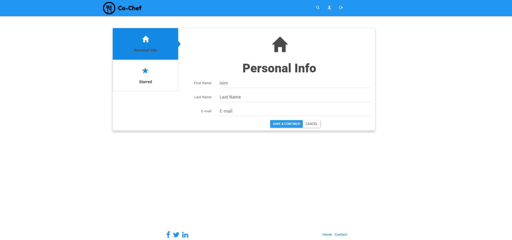

#Co-Chef

Co-Chef is a productivity tool for your kitchen. When you have a good that you don't know what to do, Co-Chef guides you. For example, on main page click for the goods that you have and press filter button, Co-Chef shows you that recipes you can cook with that good.

##Getting Started

This repository is ready to use. MVP is working. There's just sample recipes and goods. It also contains registration component.

##Built With

* React JS
* Bootstrap JS
* Bootstrap CSS
* Node.js
* Express.js
* Postgre SQL

Also used some npm packages (like body parser, csurf, multer, bcrypt), you can find all of them in package.json.

##Missing Parts
- Starring recipes

##Screenshots

###Main Page

###Results

###Login

###Profile Page

##License
This project is licensed under the MIT License - see the LICENSE.txt file for details.
